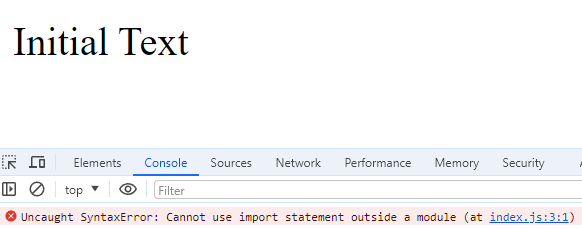
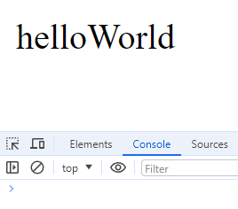

# Webpack Demo

## Objective

This assignment aims to reinforce your understanding of Webpack by setting up a basic Webpack configuration in a new project. You will create a simple web application that uses Webpack to bundle JavaScript modules and includes basic configuration for handling CSS files.

## Project Description

This project serves as a demonstration of setting up a basic web application using Webpack for bundling JavaScript modules and handling dependencies. The initial setup starts without using Webpack, followed by integrating Webpack to manage and bundle the application's assets.

## Features

- **Initial Setup:** A simple web application structure without Webpack.
- **Webpack Integration:** Configuration to bundle JavaScript modules using Webpack.
- **Lodash Integration:** Demonstrates importing and using Lodash library in the application.

## Project Structure

```graphql
webpack-demo/
│
├── dist/                  # Output directory for bundled files
│   ├── index.html         # Main HTML file
│   └── bundle.js          # Bundled JavaScript file (generated by Webpack)
│
├── src/                   # Source directory
│   └── index.js           # Main JavaScript file
│
├── webpack.config.js      # Webpack configuration file
├── package.json           # Project metadata and dependencies
└── README.md              # Project documentation

```

## Build Instructions

### Without Webpack

1. Navigate to the project directory and Initialize as npm project with the command :`npm init -y`.
2. Open `dist/index.html` in a web browser to view the application.

#### dist/index.html

```html
<!DOCTYPE html>
<html lang="en">
  <head>
    <meta charset="UTF-8" />
    <meta name="viewport" content="width=device-width, initial-scale=1.0" />
    <title>Simple App Without Webpack</title>
  </head>
  <body>
    <div id="content">Initial Text</div>
    <script src="../src/index.js"></script>
  </body>
</html>
```

#### src/index.js

```js
document.getElementById("content").innerText = "Hello, World!";

import _ from "lodash";
const newText = _.camelCase("hello world");
document.getElementById("content").innerText = newText;
```

3. An error should occur in the console because Lodash isn't installed or bundled.

### With Webpack

1. Install Webpack and Webpack CLI:

```bash
npm install --save-dev webpack webpack-cli
```

2. Create a Webpack Configuration File: `webpack.config.js`

```js
const path = require("path");

module.exports = {
  entry: "./src/index.js",
  output: {
    filename: "bundle.js",
    path: path.resolve(__dirname, "dist"),
  },
  mode: "development",
};
```

3. Install Lodash:

```bash
npm i lodash
```

4. Bundle with Webpack:
   - Add a build script in `package.json: "build": "webpack"`
5. Run the build script:

```bash
npm run build
```

6. Switch script's src to complied js file:

```html
<script src="/dist/bundle.js"></script>
```

7. Open `dist/index.html` in browser to ensure text updated without errors.

## Screenshots

### Error Screenshot



### Success Screenshot


